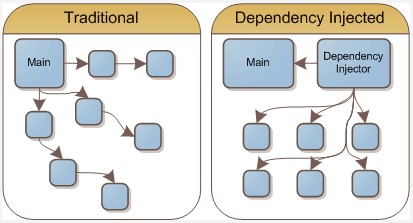
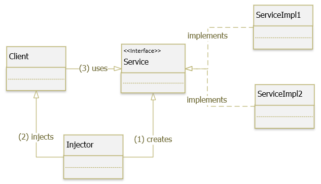

# Intro
- Nguyên lý SOLID trong OOP: chữ D chính là DIP – Dependency Inversion Principle (nguyên lý đảo ngược sự phụ thuộc). Nội dung của nguyên lý này:
  + Các module cấp cao không nên phụ thuộc vào các module cấp thấp. Cả 2 nên phụ thuộc vào abstraction.
  + Interface (abstraction) không nên phụ thuộc vào chi tiết, mà ngược lại, chi tiết nên phụ thuộc vào abstraction. Các class giao tiếp với nhau thông qua interface, không phải thông qua implementation.
- Chúng ta thường hay lẫn lộn giữa các khái niệm Dependency Inversion Principle (DIP), Inversion of Control (IoC), Dependency Injection (DI). Ba khái niệm này tương tự nhau và có một mục đích duy nhất là tạo ra ứng dụng ít kết dính (loosely coupling), dễ mở rộng (flexibility).
- Sự khác biệt giữa 3 khái niệm trên:
  + Dependency Inversion Principle (DIP): là một nguyên lý để thiết kế và viết code.
  + Inversion of Control (IoC): là một design pattern được tạo ra để code có thể tuân thủ nguyên lý Dependency Inversion. Có nhiều cách hiện thực Pattern này như ServiceLocator, Event, Delegate, … và Dependency Injection là một trong các cách đó.
  + Dependency Injection (DI): là một Design Pattern, một cách để hiện thực Inversion of Control Pattern. DI chính là khả năng liên kết giữa các thành phần lại với nhau, các module phụ thuộc (dependency) sẽ được inject vào module cấp cao



# Dependency Injection là gì
- Dependency Injection là một design pattern cho phép xóa bỏ sự phụ thuộc giữa các module, làm cho ứng dụng dễ dàng hơn trong việc thay đổi module, bảo trì code và testing.
- Nhiệm vụ của dependency injection:
  + Tạo các đối tượng.
  + Quản lý sự phụ thuộc (dependencies) giữa các đối tượng.
  + Cung cấp (inject) các phụ thuộc được yêu cầu cho đối tượng (được truyền từ bên ngoài đối tượng).

# Nguyên tắc hoạt động của DI:
- Các module không giao tiếp trực tiếp với nhau, mà thông qua interface: module cấp thấp sẽ implement interface, module cấp cao sẽ gọi module cấp thấp thông qua interface (_Các Object nên phụ thuộc vào các Abstract Class và thể hiện chi tiết của nó sẽ được Inject vào đối tượng lúc runtime_)
- Việc khởi tạo các module cấp thấp sẽ do DI Container/ IoC Container thực hiện.
- Việc Module nào gắn với interface nào sẽ được config trong file properties, trong file XML hoặc thông qua Annotation (Annotation là một cách thường được sử dụng trong các Framework, chẳng hạn như @Inject với CDI, @Autowired với Spring hay @ManagedProperty với JSF.)

# Các dạng Dependency Injection
- Constructor Injection: Các dependency sẽ được container truyền vào (inject vào) 1 class thông qua constructor của class đó. Đây là cách thông dụng nhất.
- Setter Injection: Các dependency sẽ được truyền vào 1 class thông qua các hàm Setter.
- Fields/ properties: Các dependency sẽ được truyền vào 1 class một cách trực tiếp vào các field.
- Interface Injection: Class cần inject sẽ implement 1 interface. Interface này chứa 1 hàm tên Inject. Container sẽ injection dependency vào 1 class thông qua việc gọi hàm Inject của interface đó. Đây là cách rườm rà và cũng ít được sử dụng.
- Service Locator: nó hoạt động như một mapper, cho phép thay đổi code tại thời điểm run-time mà không cần biên dịch lại ứng dụng hoặc phải khởi động lại.

# VD
```
public class EmailService {
    public void sendEmail(String message) {
        System.out.println("Message: " + message);
    }
}
// Ví dụ chúng ta có một class cho phép User có thể gửi message.
public class UserController {
    private EmailService emailService = new EmailService();

    public void sendMessage() {
        emailService.sendEmail("Hello Dependency injection pattern");
    }
}
```
Giới hạn:
- Lớp UserController phụ thuộc trực tiếp vào class EmailService. Mỗi khi có thay đổi trong lớp EmailService, chẳng hạn thêm tham số cho constructor của class này lên sẽ ảnh hưởng trực tiếp đến class UserController.
- Một User khác không muốn sử dụng cách gửi message thông qua email, chẳng hạn qua sms, facebook...

Giải pháp: xem code Java

# VD2
- Xem code trong package design_pattern.creational.dependency_injection.ex2
- Giả sử 1 class User sẽ gồm các thuộc tính HairStyle, Outfit, Shoe. Mỗi 1 thuộc tính này có nhiều kiểu khác nhau (chẳng hạn Shoe thì có: Vans, Converse...). Do đó class User sẽ chỉ phụ thuộc vào các interface (tức là các thuộc tính của nó chỉ là interface), còn việc tạo ra instance cụ thể sẽ được tạo lúc runtime

# Cài đặt
Các thành phần tham gia Dependency Injection Pattern (xem ảnh):
- Client : là một class cần sử dụng Service.
- Service : là một class/interface cung cấp service/dependency cho Client.
- ServiceImpl: cài đặt các phương thực cụ thể của Service.
- Injector: là một lớp chịu trách nhiệm khởi tạo các service và inject các thể hiện này cho Client.



# Sử dụng khi nào
- Khi cần inject các giá trị từ một cấu hình cho một hoặc nhiều module khác nhau.
- Khi cần inject một dependency cho nhiều module khác nhau.
- Khi cần một vài service được cung cấp bởi container.
- Khi cần tách biệt các dependency giữa các môi trường phát triển khác nhau. Chẳng hạn, với môi trường dev chỉ cần log việc gửi mail, trong môi trường product cần gởi mail thông qua một API thật sự.

# Inversion of Control
- Dependency Injection giúp chúng ta dễ dàng mở rộng code và giảm sự phụ thuộc giữa các dependency với nhau. Tuy nhiên, lúc này, khi code bạn sẽ phải kiêm thêm nhiệm vụ Inject dependency (tiêm sự phụ thuộc).
- Thử tưởng tượng một Class có hàng chục dependency thì bạn sẽ phải tự tay inject từng ý cái. Việc này lại dẫn tới khó khăn trong việc code, quản lý code và dependency
```
HairStyle hairStyle1 = new Sidepart();
Outfit outfit1 = new Coolmate();
Shoe shoe1 = new Converse();

User u1 = new User(hairStyle1, outfit1, shoe1);
```
- Giá như lúc này có thằng làm hộ được chúng ta việc này thì tốt biết mấy
- Bây giờ giả sử, chúng ta định nghĩa trước toàn bộ các dependency có trong Project, mô tả nó và tống nó vào 1 cái kho và giao cho một thằng tên là framework quản lý. Bất kỳ các Class nào khi khởi tạo, nó cần dependency gì, thì cái framework này sẽ tự tìm trong kho rồi inject vào đối tượng thay chúng ta. Đó cũng chính là nguyên lý chính của Inversion of Control. Spring framework đã hỗ trợ IOC
- Hollywood principle cũng thường được gọi là một IoC hay DI:
```
Don't call me, I'll call you. (Đừng gọi cho chúng tôi, chúng tôi sẽ gọi cho bạn.)
```

# Ref
- https://loda.me/spring-giai-thich-dependency-injection-di-va-io-c-bang-ngoc-trinh-loda1553326013583/
- https://gpcoder.com/4975-huong-dan-java-design-pattern-dependency-injection/
