## Design patterns

Developers spend much more time **extending and changing code** than they do originally developing it (các dev thường dành nhiều time để mở rộng và sửa đổi code hơn là phát triển code mới)

Design patterns are intended to help you **handle change** as you have to adapt your code to new and unforeseen circumstances

One of the design insights of this book is that you should go for **loose coupling** when possible

## New words

- Polymorphism: tính đa hình
- Composition: tính tổng hợp, kết hợp (1 class sẽ gồm nhiều object khác)
- Inheritance: tính kế thừa (1 class extends từ 1 class khác)
- Base class: lớp cơ sở
- Derived class: lóp dẫn xuất (kế thừa từ base class)
- freestanding (adj): đứng 1 mình
- volatile /ˈvɑː.lə.t̬əl/ (adj): dễ thay đổi (change rapidly and unpredictably)
- interchangeable (adj): có thể hoán đổi lẫn nhau
- Runtime: là giai đoạn mà chương trình đang chạy (đang thực thi). VD như `RuntimeException` là `Exception` xảy ra trong thời gian chương trình chạy, chẳng hạn `ArrayIndexOutOfBoundsException`, `NullPointerException`, `ArithmeticException` là các ngoại lệ chỉ xảy ra tại lúc runtime
- Coordination: sự phối hợp
- Coupling (n): sự gắn kết. **Loose coupling**: sự gắn kết lỏng lẻo >< tight coupling

  > For maximal flexibility, go for loose coupling when it comes to information flow, not tight coupling (Để có tính linh hoạt tối đa, các object nên có sự gắn kết lỏng lẻo với nhau, không nên gắn kết chặt chẽ)

  > Make the coupling between entities as loose as possible (Làm cho sự gắn kết giữa các entity/object lỏng lẻo nhất có thể)

  > It's difficult to coordinate objects if they’re tightly coupled (Rất khó để điều phối các đối tượng nếu chúng được kết nối chặt chẽ với nhau)

- Decouple (v): tách riêng; làm giản sự gắn kết (giữa các object)

## Chapter 2: Putting Plans into Action with the Strategy Pattern

Design insight: **Separate the parts of your code that will change the most from the rest of your application. And always try to reuse those parts as much as possible.**

### 2.1. Inheritance vs Composition

Polymorphism (đa hình) thường phát huy tác dụng khi bạn làm việc với design pattern vì design pattern có xu hướng thiên về composition hơn là inheritance. (Composition (tổng hợp, kết hợp) nghĩa là khi object của bạn chứa các object khác thay vì kế thừa từ chúng.

Design pattern-oriented programming (Lập trình hướng mẫu thiết kế) thường thích composition hơn là inheritance. Khi bạn sử dụng composition, code của bạn chứa các đối tượng khác, thay vì kế thừa từ chúng.

### 2.2. Bài toán thiết kế Vehicle

Xét ví dụ sau, giả sử bạn muốn thiết kế các Vehicle (phương tiện), ví dụ này tập trung vào method `go` thôi, mỗi phương tiện đều phải có method `go`, do đó ta tạo 1 `abstract class` như sau:

```java
abstract class Vehicle {
    public Vehicle() {}

    public void go() {
        System.out.println("Now I'm driving.");
    }
}
```

Lúc này bạn muốn thiết kế 2 phương tiện là xe đua đường phố và xe đua công thức 1, chúng đều có chung method `go`, do đó bạn nghĩ đến việc cho 2 sản phẩm đó kế thừa class trên:

```java
class StreetRacer extends Vehicle {
}

class FormulaOne extends Vehicle {
}
```

Mọi thứ trông khá ổn. Lúc này bạn lại phải thiết kế thêm sản phẩm thứ 3 là máy bay trực thăng, và thứ 4 là máy bay phản lực:

```java
class Helicopter extends Vehicle {
}

class Jet extends Vehicle {
}

public class StartTheRace {
    public static void main(String[] args) {
        StreetRacer streetRacer = new StreetRacer();
        FormulaOne formulaOne = new FormulaOne();
        Helicopter helicopter = new Helicopter();

        streetRacer.go();   // Now I'm driving.
        formulaOne.go();    // Now I'm driving.
        helicopter.go();    // Now I'm driving.
        jet.go();           // Now I'm driving.
    }
}
```

Trông chả ổn tý nào! Máy bay phải bay chứ, nhỉ! Và bạn nghĩ ngay tới việc `override` lại method `go` của class cha, quá đơn giản phải ko:

```java
class Helicopter extends Vehicle {
    @Override
    public void go() {
        System.out.println("Now I'm flying.");
    }
}

class Jet extends Vehicle {
    @Override
    public void go() {
        System.out.println("Now I'm flying super fast!.");
    }
}

public class StartTheRace {
    public static void main(String[] args) {
        StreetRacer streetRacer = new StreetRacer();
        FormulaOne formulaOne = new FormulaOne();
        Helicopter helicopter = new Helicopter();
        Jet jet = new Jet();

        streetRacer.go();   // Now I'm driving.
        formulaOne.go();    // Now I'm driving.
        helicopter.go();    // Now I'm flying.
        jet.go();           // Now I'm flying super fast!.
    }
}
```

### 2.3. Xử lý thay đổi với `has-a` thay vì `is-a`

Thời gian trôi qua, rất nhiều thứ thay đổi và bạn phải thiết kế lại cách máy bay di chuyển rất nhiều lần (= cách update method `go` nhiều lần):

```java
class Helicopter extends Vehicle {
    @Override
    public void go() {
        System.out.println("Now I'm flying version 2.1.");
    }
}
// Tương tự với class Jet
```

Bạn cũng phải update cách di chuyển cho `StreetRacer` và `FormulaOne` nữa, và 2 loại xe này có chung cách di chuyển nên update method go của 2 thằng là như nhau, nghe có vẻ khá là `duplicated code` rồi nhỉ :v

Việc update method `go` trong bản thân class như này thực sự ko hề hay ho chút nào, thay vào đó ta nên: **Tách các phần code sẽ thay đổi nhiều nhất khỏi phần còn lại của ứng dụng và cố gắng đặt chúng ở trạng thái tự do nhất có thể (freestanding) để dễ bảo trì.** (Trong ví dụ này thì method `go` chính là phần dễ thay đổi!)

Với inheritance, các lớp cơ sở và các lớp dẫn xuất (`base classes` and `derived classes`) có mối quan hệ `is-a`, chẳng hạn: a Helicopter `is-a` Vehicle. Base class xử lý một tác vụ cụ thể theo một cách, nhưng sau đó một lớp dẫn xuất sẽ thay đổi điều đó và lớp dẫn xuất tiếp theo sẽ thay đổi mọi thứ một lần nữa. Vì vậy, bạn đang phát tán (spread out) cách bạn xử lý một nhiệm vụ qua nhiều thế hệ class

Bạn có thể trích xuất các phần dễ thay đổi (volatile) trong code và đóng gói chúng dưới dạng các đối tượng. Làm như vậy cho phép bạn tùy code bằng cách tạo ra `composites of objects` (sự tổng hợp đối tượng). Mối quan hệ giữa chúng lúc này là `has-a`: Helicopter `has-a` certain/different way of moving (Helicopter có 1 cách di chuyển nhất định)

Túm lại: **Khi có nhiều thay đổi, nên dùng quan hệ `has-a` thay vì `is-a`, và TÁCH RIÊNG CODE THƯỜNG XUYÊN THAY ĐỔI sang 1 object riêng, thay vì KẾ THỪA TỪ ĐỐNG CODE HAY THAY ĐỔI đó.**

### 2.4. Tách riêng code hay thay đổi

Remember: encapsulate code in external algorithms (các lớp GoAlgorithm) for easy use rather than spreading it around inside your core code and modifying it throughout that code (các lớp StreetRacer, Jet...).

```java
interface GoAlgorithm {
    void go();
}

// Tạo từng cách di chuyển riêng
class GoByDriving implements GoAlgorithm {
    @Override
    public void go() {
        System.out.println("Now I'm driving version 2.2.");
    }
}

class GoByFlying implements GoAlgorithm {
    @Override
    public void go() {
        System.out.println("Now I'm flying version 2.2.");
    }
}

class GoByFlyingFast implements GoAlgorithm {
    @Override
    public void go() {
        System.out.println("Now I'm flying super fast version 2.2!.");
    }
}

// Base class Vehicle lúc này cần có 1 nơi lưu trữ thuật toán di chuyển,
// ta sẽ dùng method setGoAlgorithm để các class con sẽ có thể
// tự nó xác định thuật toán di chuyển mà nó muốn
abstract class Vehicle {
    private GoAlgorithm goAlgorithm;

    public void setGoAlgorithm(GoAlgorithm goAlgorithm) {
        this.goAlgorithm = goAlgorithm;
    }

    // method go lúc này ko cần hard-code nữa! Sau này nếu muốn thay đổi gì
    // cũng ko cần update ở đây!
    public void go() {
        goAlgorithm.go();
    }
}

// Các class con muốn dùng cách di chuyển nào thì chỉ cần gọi method
// thiết lập cách di chuyển đó ở class cha. Ko còn class con nào phải
// custom lại method go nữa!
class StreetRacer extends Vehicle {
    public StreetRacer() {
        super.setGoAlgorithm(new GoByDriving());
    }
}

class FormulaOne extends Vehicle {
    public FormulaOne() {
        super.setGoAlgorithm(new GoByDriving());
    }
}

class Helicopter extends Vehicle {
    public Helicopter() {
        super.setGoAlgorithm(new GoByFlying());
    }
}

class Jet extends Vehicle {
    public Jet() {
        super.setGoAlgorithm(new GoByFlyingFast());
    }
}
```

Bây giờ, giả sử bạn muốn đổi cách di chuyển cho 2 phương tiện là xe đua đường phố và xe đua công thức 1: rất đơn giản, chỉ việc update `GoByDriving` là cả 2 xe đua đó đều được update, chả cần quan tâm đến các class `StreetRacer`, `FormulaOne`

```java
class GoByDriving implements GoAlgorithm {
    @Override
    public void go() {
        System.out.println("Now I'm driving version 2.3.");
    }
}
```

### 2.5. Configuring behavior at runtime

**Quan hệ "has-a" sẽ flexible nhiều hơn mối quan hệ "is-a" when it comes to configuring behavior at runtime.**

Trong cách dùng inheritance:

```java
class Jet extends Vehicle {
    @Override
    public void go() {
        System.out.println("Now I'm flying super fast!.");
    }
}
```

ta thấy method go của Jet bị hard code, bây giờ giả sử `Jet` di chuyển theo 3 bước đó là: đi chậm, sau đó bay nhanh, và cuối cùng lúc hạ cánh thì lại đi chậm, thì ta làm như nào? Nếu dùng `composition`, ta có thể THAY ĐỔI cách di chuyển trong lúc runtime như sau:

```java
Jet jet2 = new Jet();
jet2.setGoAlgorithm(new GoByDriving());
jet2.go();
jet2.setGoAlgorithm(new GoByFlyingFast());
jet2.go();
jet2.setGoAlgorithm(new GoByDriving());
jet2.go();
```

### 2.6. Strategy pattern là gì?

**Define a family of algorithms, encapsulate each one, and make them interchangeable. Strategy lets the algorithm vary independently from clients that use it**

Strategy pattern là mẫu định nghĩa 1 tập các thuật toán có thể hoán đổi cho nhau, sau đó việc chọn thuật toán nào sẽ được quyết định lúc runtime

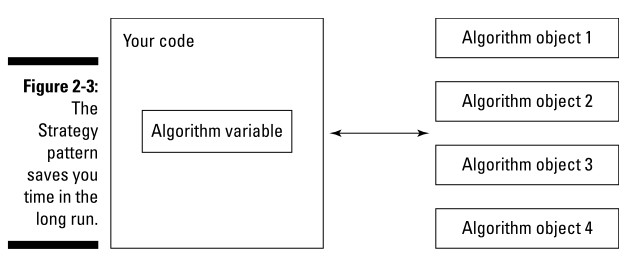

Nên dùng Strategy pattern trong những trường hợp sau:

- Đoạn code hay thay đổi cần phải tách riêng để dễ maintain
- You want to avoid muddling how you handle a task by having to split implementation code over several inherited classes (???)
- Muốn xác định/thay đổi thuật toán sử dụng lúc runtime

## Chapter 3: The Decorator and Factory Patterns

### 3.1 Ví dụ về việc mua chiếc burger

Xét ví dụ thực tế sau: giả sử bạn vào 1 quán ăn nhanh (KFC, Lotteria...):

- Bạn gọi 1 chiếc burger thịt
- 1 lát sau bạn lại thay đổi: "Bạn ơi mình muốn đổi sang 1 chiếc burger thịt với topping phô mai nhé"
- Nhân viên nhìn bạn 1 cái và nói "Oke"
- Xíu nữa, sau khi nhìn qua menu, b lại nói: "Hay là cho mình 1 chiếc burger thịt với phô mai và socola, được ko?"
- The cook stares at you and seems on the verge of saying something unpleasant! Nhưng vẫn nói "Oke"
- Bạn nhận lấy chiếc burger của mình và nói: "Liệu có thể thêm topping khoai tây được ko ạ?"
- ...

Một chiếc burger có thể trở thành burger phô mai, rồi lại thành burger phô mai socola, và rồi có thể thêm topping rất dễ dàng mà ko phải đập đi làm lại từ đầu. Chiếc burger là chính bắt buộc phải có, còn phô mai, socola hay là khoai tây thì cũng chỉ là các vật trang trí được thêm vào mà thôi (decorator)

Nếu dùng Inheritance để giải quyết thì sẽ thiết kế như sau:

- Tạo class `MeatBurger`
- Tạo các class con kế thừa từ `MeatBurger`: `CheeseMeatBurger`, `ChocolateMeatBurger`, `PotatoMeatBurger`
- Cần tạo THÊM các class con nữa kế thừa từ `MeatBurger`, tùy theo nhu cầu của khách hàng: `CheeseChocolateMeatBurger`, `CheesePotatoMeatBurger`, `CheeseChocolatePotatoMeatBurger`...
- Mệt chưa :v
- Giả sử có thêm 1 loại burger nữa là `VeggieBurger` (burger chay), cũng có các loại topping như trên, bài toán lúc này lại thêm rắc rối nếu dùng Inheritance vì cần tạo thêm các class con: `CheeseChocolateVeggieBurger`...

Dùng decorator pattern: xem code [BurgerExample](./chapter3/decorator/BurgerExample.java)

Ref:

- https://refactoring.guru/design-patterns/decorator
- https://viblo.asia/p/hieu-biet-co-ban-ve-decorator-pattern-pVYRPjbVG4ng

### 3.2. Decorator pattern

It's all about extending the functionality of a given class: sau khi bạn code xong 1 class, bạn có thể decor cho nó bằng cách **using wrapper code to extend your core code**, hay nó cách khác là wrap nó trong 1 class khác. Do đó Decorator pattern còn được gọi là Wrapper pattern

Doing so means that you won't have to keep modifying the original class's code over and over again

Đây chính là nguyên lý **Open/closed principle** trong **SOLID**

### 3.1. Factory pattern: ví dụ về multiple database

Theo [GPCoder](https://gpcoder.com/4352-huong-dan-java-design-pattern-factory-method/):

- Factory Pattern đúng nghĩa là một nhà máy, và nhà máy này sẽ "sản xuất" các đối tượng theo yêu cầu của chúng ta.
- Factory Pattern được sử dụng khi có một class cha (super-class) với nhiều class con (sub-class), dựa trên đầu vào và phải trả về 1 trong những class con đó

Giả sử bạn cần connect tới 3 loại database trong 1 dự án, thì có thể dùng factory pattern để tạo object Connection:

```java
package dp_for_dummies.chapter3.factory;

abstract class Connection {
    public Connection() {}

    public String description() {
        return "Generic";
    }
}

class MySqlConnection extends Connection {
    public MySqlConnection() {}

    @Override
    public String description() {
        return "MySQL";
    }
}
class OracleConnection extends Connection {} // Similar to MySqlConnection
class SqlServerConnection extends Connection {} // Similar to MySqlConnection

// A factory class is a factory class, and that’s it. It’s not designed to be extended.
// Trong sách đặt tên là "FirstFactory"
final class ConnectionFactory {
    protected String type;

    public ConnectionFactory(String t) {
        type = t;
    }

    public Connection createConnection() {
        if (type.equals("Oracle")) {
            return new OracleConnection();
        } else if (type.equals("SQL Server")) {
            return new SqlServerConnection();
        } else {
            return new MySqlConnection();
        }
    }
}

public class FactoryPattern {
    public static void main(String[] args) {
        ConnectionFactory factory = new ConnectionFactory("SQL Server");
        Connection conn = factory.createConnection();
        System.out.println(conn.description());
    }
}
```

Theo GoF, Factory pattern nên: **Define an interface for creating an object, but let subclasses decide which class to instantiate.**: tức là bạn chỉ cần định nghĩa 1 interface Factory, và **để các subclass tự implement 1 factory cụ thể**

Quay lại ví dụ trên, giả sử bây giờ, với mỗi 1 database, bạn cần có thêm 1 cách kết nối `secure` nữa, chẳng hạn:

```java
class SecureMySqlConnection extends Connection {
    public SecureMySqlConnection() {}

    @Override
    public String description() {
        return "MySQL secure";
    }
}
class SecureOracleConnection extends Connection {}
class SecureSqlServerConnection extends Connection {}
```

Ta cần định nghĩa 1 abstract factory như sau, factory này sẽ có 1 method để tạo connection. Sau đó tạo các factory cụ thể để subclass (user) chọn, hoặc cũng có thể để user tự tạo factory

```java
abstract class ConnectionFactory {
    public ConnectionFactory() {}

    protected abstract Connection createConnection(String type);
}
class NormalFactory extends ConnectionFactory {
    @Override
    public Connection createConnection(String type) {
        if (type.equals("Oracle")) {
            return new OracleConnection();
        } else if (type.equals("SQL Server")) {
            return new SqlServerConnection();
        } else {
            return new MySqlConnection();
        }
    }
}
class SecureFactory extends ConnectionFactory {
    @Override
    public Connection createConnection(String type) {
        if (type.equals("Oracle")) {
            return new SecureOracleConnection();
        } else if (type.equals("SQL Server")) {
            return new SecureSqlServerConnection();
        } else {
            return new SecureMySqlConnection();
        }
    }
}
```

Giờ chỉ việc xài thôi:

```java
// tự chọn 1 factory theo ý muốn
ConnectionFactory factory1 = new SecureFactory();

// sau đó yêu cầu factory tạo object connection theo ý muốn
Connection conn1 = factory1.createConnection("SQL Server");

System.out.println(conn1.description());

ConnectionFactory factory2 = new NormalFactory();
Connection conn2 = factory2.createConnection("Oracle");
System.out.println(conn2.description());
```

## Chapter 4: Observer and Chain of Responsibility Patterns

### 4.1. Observer pattern vs Chain of Responsibility Pattern

Sếp của bạn muốn nhận tất cả thông báo về bất kỳ thay đổi nào tới database, bạn liền nghĩ tới observer pattern

> You smile to yourself as you turn to the code, wondering how happy the boss is going to be with about 200,000 notifications a day

Observer pattern còn được gọi là Event-Subscriber, Listener. Nó hoạt động giống như mô hình Pub-sub đó (khá quen thuộc): Observer pattern cho phép các observer (subscriber, listener) nhận thông báo mỗi khi 1 object nào đó thay đổi. Mỗi 1 observer sẽ register (subscribe, follow, listen) tới 1 object Publisher, và khi Publisher thay đổi, mọi observer sẽ được thông báo **đồng thời**

Chain of Responsibility Pattern: khá giống với Observer pattern, chỉ khác là các observer được kết nối thành 1 chuỗi (chain). Thông báo sẽ đi từ observer này sang observer khác (tức là 1 observer xử lý thông báo xong có thể pass hoặc ko pass tới observer tiếp theo)

Theo GoF, Observer pattern should **Define a one-to-many dependency between objects so that when one object changes state, all its dependents are notified and updated automatically**

Các observer sẽ có thể subscribe/unsubscribe 1 Publisher tại lúc runtime, hoạt động như sau:

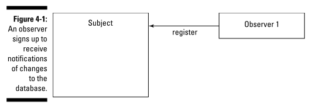

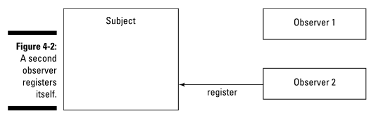

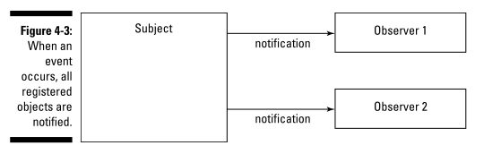

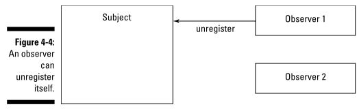

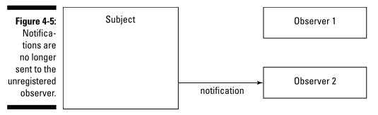

### 4.2. Implement observer pattern to send notification to your boss

Đầu tiên cần 2 interface là Publisher và Observer

```java
// Trong sách đặt là Subject
public interface Publisher {
    // Thêm mới 1 object observer (có thể gọi là subscriber, người quan sát, người theo dõi),
    // Việc lưu 1 subscriber mới ở đâu sẽ để class con tự implement (Array, List, Hash...)
    public void registerObserver(Observer o);
    public void removeObserver(Observer o);
    // Thông báo cho tất cả các observer đã thêm ở trên,
    // việc thông báo cái gì sẽ để class con tự implement
    public void notifyObservers();
}

// Observer giống như Subscriber vậy
public interface Observer {
    // Nhận thông báo từ Publisher:
    // Method này sẽ được bên Publisher gọi mỗi khi Publisher có thay đổi gì mới
    // Việc gọi khi nào sẽ do class con của Publisher implement
    public void update(String operation, String record);
}
```

Sửa code truy cập tới database: ta cần implement `Publisher` ở trên:

```java
// Class giúp thao tác tới database
class DatabaseHelper implements Publisher {

    private List<Observer> observers;
    private String operation;
    private String record;

    public DatabaseHelper() {
        // dùng LinkedList vì chủ yếu dùng các thao tác add, remove, duyệt tuần tự,
        // chứ ko cần truy cập phần tử ngẫu nhiên
        observers = new LinkedList<>();
    }

    @Override
    public void registerObserver(Observer o) {
        observers.add(o);
    }

    @Override
    public void removeObserver(Observer o) {
        observers.remove(o);
    }

    @Override
    public void notifyObservers() {
        for (Observer o : observers) {
            o.update(operation, record);
        }
    }

    // Save record xuống database, sau khi thực hiện thì sẽ notify tới các observers
    public void saveToDb(String operation, String record) {
        this.operation = operation;
        this.record = record;
        notifyObservers();
    }
}
```

Phía class `Boss`, chỉ cần implement interface `Observer` là sẽ nhận được thông báo mỗi khi database được update

```java
// Các anh dev cần nhận được thông báo về các thay đổi của database
class Developer implements Observer {
    @Override
    public void update(String operation, String record) {
        System.out.printf("Dev đã thấy được database thay đổi, hành động '%s' trên bản ghi '%s'\n",
                operation, record);
    }
}

// Ông sếp rảnh quá nên cũng muốn nhận thông báo về các thay đổi của database
class Boss implements Observer {
    @Override
    public void update(String operation, String record) {
        System.out.printf(
                "Boss cũng có thể thấy được database thay đổi, hành động '%s' trên bản ghi '%s'\n",
                operation, record);
    }

}
```

[Full code: check this folder](./chapter4/observer/ob1_simple_example/)

### 4.3. Loose coupling

> The Observer and Chain of Responsibility design patterns implement what’s called **loose coupling**

> The design insight here is that **loose coupling between objects**, _rather than simply extending objects_ by making them do more than they were meant to do

> Go for loose coupling when it comes to information flow

### 4.4. Critical issue when passing by reference

Giả sử `record` ko phải kiểu String (immutable) nữa, mà là 1 kiểu Object, chẳng hạn Employee:

```java
public class Employee {
    private int id;
    private String name;
    // Getters, setters, constructor
    @Override
    public String toString() { return "Employee{id:'" + id + "',name:'" + name + "'}"; }
}
public interface Observer {
    // record kiểu Object chứ ko phải String nữa
    public void update(String operation, Object record);
}
class DatabaseHelper implements Publisher {
    private List<Observer> observers;
    private String operation;
    private Employee employee; // record kiểu Employee chứ ko phải String nữa

    @Override
    public void notifyObservers() {
        for (Observer o : observers) {
            // Bởi vì Java pass theo reference, do đó bên Observer
            // HOÀN TOÀN CÓ THỂ THAY ĐỔI giá trị bên trong Employee
            o.update(operation, employee);
        }
    }

    public void saveToDb(String operation, Employee employee) {
        this.operation = operation;
        this.employee = employee;
        notifyObservers();
    }
}
```

Bởi vì Java pass theo reference, do đó bên Observer HOÀN TOÀN CÓ THỂ THAY ĐỔI giá trị bên trong Employee:

```java
// Các anh dev cần nhận được thông báo về các thay đổi của database
class Developer implements Observer {
    @Override
    public void update(String operation, Object record) {
        System.out.printf(
                "Dev đã thấy được database thay đổi:\n\thành động '%s' trên bản ghi '%s'\n",
                operation, record);

        // This name has been alter by an observer!!! This is a critical issue that should be fixed
        if (record instanceof Employee) {
            ((Employee) record).setName("Hahaha!");
        }
    }
}
```

[Full code: check this folder](./chapter4/observer/ob2_pass_reference/)

Kết quả run thử:

```
Dev đã thấy được database thay đổi:
	hành động 'INSERT' trên bản ghi 'Employee{id:'1',name:'Lorem ipsum'}'
Leader đã thấy được database thay đổi:
	hành động 'INSERT' trên bản ghi 'Employee{id:'1',name:'Hahaha!'}'
Boss cũng có thể thấy được database thay đổi:
	hành động 'INSERT' trên bản ghi 'Employee{id:'1',name:'Hahaha!'}'
```

Ta thấy sau khi Dev thay đổi record, Leader và Boss ko còn nhận được thông báo đúng nữa! (Tên của employee bị thay đổi 'Lorem ipsum' -> 'Hahaha', leader và boss ko hề biết)

### 4.5. Using Java built-in Observer

Giải pháp: có thể dùng Publisher và Observer có sẵn của Java, nhưng hiện tại đã bị lỗi thời:

```java
import java.util.Observable;
@SuppressWarnings("deprecation")
class DatabaseHelper extends Observable {
    // ...
    public void saveToDb(String operation, Employee employee) {
        this.setOperation(operation);
        this.setEmployee(employee);
        setChanged();   // phải gọi method này của Observable trước khi notify
        notifyObservers();  // notify sự thay đổi cho các observer biết
    }
}

import java.util.Observable;
import java.util.Observer;
@SuppressWarnings("deprecation")
class Developer implements Observer {
    @Override
    public void update(Observable obs, Object arg) {
        System.out.printf(
                "Dev đã thấy được database thay đổi:\n\thành động '%s' trên bản ghi '%s'\n",
                ((DatabaseHelper) obs).getOperation(),
                ((DatabaseHelper) obs).getEmployee().getName());

        // Thay đổi data ở đây ko ảnh hưởng tới các observer khác
        ((DatabaseHelper) obs).getEmployee().setName("Hahaha");
    }
}
```

[Full code: check this folder](./chapter4/observer/ob3_pass_reference_using_java_observer/)

Kết quả run: 1 observer thay đổi data sẽ ko ảnh hưởng tới các observer khác

```
Dev đã thấy được database thay đổi:
	hành động 'INSERT' trên bản ghi 'Employee{id:'1',name:'Lorem ipsum'}'
Leader đã thấy được database thay đổi:
	hành động 'INSERT' trên bản ghi 'Employee{id:'1',name:'Lorem ipsum'}'
Boss cũng có thể thấy được database thay đổi:
	hành động 'INSERT' trên bản ghi 'Employee{id:'1',name:'Lorem ipsum'}'
```

Tuy nhiên, Observer có sẵn của Java đã bị deprecated, do đó đây ko hẳn là 1 solution hay ho lắm!

TODO: tìm 1 giải pháp khác!!!

### 4.6. Chain of Responsibility Pattern

Khá giống với Observer pattern, khác ở chỗ pattern này có nhiều observer được chain (nối) với nhau giống 1 DSLK, và request đầu tiên sẽ được gửi tới observer1, nếu nó ko xử lý được thì sẽ pass xuống observer2...

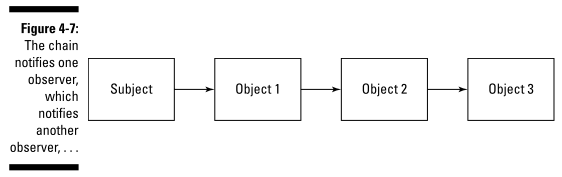

Ví dụ: giả sử hệ thống của bạn có 3 tầng như sau:

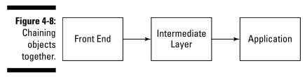

User sẽ gửi request nhờ xử lý, đầu tiên sẽ để tầng Frontend handle đã, nếu ko handle được thì tầng FE sẽ gửi request đó xuống tầng 2, nếu tầng 2 vẫn ko xử lý được thì sẽ gửi xuống tầng dưới cùng là tầng Application để xử lý

```java
public interface HelpInterface {
    public void getHelp(HelpEnum helpEnum);
}

class FrontEnd implements HelpInterface {
    // Biến này chính là observer tiếp theo, nếu observer này ko xử lý được
    // thì sẽ pass request xuống observer đó
    private HelpInterface successor;
    public FrontEnd(HelpInterface successor) {
        this.successor = successor;
    }
    @Override
    public void getHelp(HelpEnum helpEnum) {
        if (helpEnum != HelpEnum.FRONT_END_HELP) {
            successor.getHelp(helpEnum);
        } else {
            System.out.println("This is the front end. Don’t you like it?");
        }
    }
}
class IntermediateLayer implements HelpInterface {
    private HelpInterface successor;    // observer tiếp theo
    public IntermediateLayer(HelpInterface successor) {
        this.successor = successor;
    }
    @Override
    public void getHelp(HelpEnum helpEnum) {
        if (helpEnum != HelpEnum.INTERMEDIATE_LAYER_HELP) {
            successor.getHelp(helpEnum);
        } else {
            System.out.println("This is the intermediate layer. Nice, eh?");
        }
    }
}
class Application implements HelpInterface {
    public Application() {}
    @Override
    public void getHelp(HelpEnum helpEnum) {
        System.out.println(
                "This is final help layer, if we cannot help you, try to find help from somewhere else!");
    }
}
```

## Chapter 5: From One to Many: The Singleton and Flyweight Patterns

### 5.1. Singleton pattern

Đây là pattern đơn giản nhất rồi nên chả cần nói nhiều: Singleton đảm bảo 1 class chỉ có duy nhất 1 instance, và cung cấp 1 method để có thể truy cập vào instance đó

Có nhiều cách implement Singleton (bao gồm cả thread safe), [xem thêm tại đây](../design_pattern/creational/singleton/readme.md)

Note: việc implement singleton dùng `synchronized method` khá là expensive

### 5.2. The Flyweight Pattern Makes One Look like Many

Ngoài Singleton, Flyweight Pattern cũng có thể hạn chế việc tạo mới object, nhưng pattern này sẽ cho bạn cảm giác là đang dùng nhiều object dù thực chất bạn chỉ đang dùng 1 object 🤨

**A flyweight is a shared object that can be used in multiple contexts simultaneously**

Bất cứ khi nào bạn có một số lượng lớn các object rất lớn, có thể nghĩ tới Flyweight pattern. Pattern này hoạt động giống như 1 template vậy

Giả sử có 1 class Student như sau:

```java
class Student {
    private String name;
    private int id;
    private int score;
    private double averageScore;    // điểm trung bình của cả lớp

    // getters, setters

    public double getStanding() {
        return ((score) / averageScore - 1.0) * 100.0;
    }
}
```

Trong đó field `averageScore` là giống nhau nhau với từng học sinh. Ta sẽ tạo duy nhất 1 object Student có averageScore cố định trong suốt chương trình

```java
public static void main(String[] args) {
    String names[] = {"Ralph", "Alice", "Sam"};
    int ids[] = {1001, 1002, 1003};
    int scores[] = {45, 55, 65};

    double total = Arrays.stream(scores).reduce(0, (a, b) -> a + b);
    double averageScore = total / scores.length;
    Student student = new Student(averageScore);    // chỉ tạo 1 object Student

    for (int i = 0; i < scores.length; i++) {
        student.setName(names[i]);
        student.setId(ids[i]);
        student.setScore(scores[i]);
        System.out.printf("Name: %s, with standing: %.0f%%\n", student.getName(),
                student.getStanding());
    }
}
```

## Chapter 6: The Adapter and Facade Patterns

### 6.1. Adapter pattern

The Adapter design pattern lets you fix the interface between objects and classes without having to modify the objects or classes directly

Giả sử hệ thống của bạn có 2 phần: UI và BE. Flow của hệ thống là UI gửi object `Ace` cho BE xử lý. Và BE cũng chỉ nhận object `Ace` mà thôi

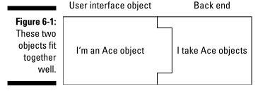

Một ngày đẹp trời, sếp bạn nói muốn BE chuyển sang dùng object mới là `Acme`, khi này phía UI vẫn gửi object `Ace`, còn BE lúc này chỉ nhận `Acme` thôi 😑

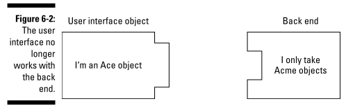

Solution: tạo 1 adapter để chuyển đổi từ `Ace` (gửi từ UI) sang `Acme` (cho BE xài)

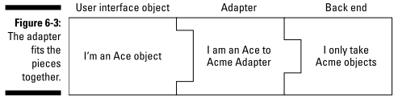

```java
// Phía UI chỉ gửi cho BE object kiểu Ace, và hiện tại BE cũng chỉ handle object kiểu Ace
interface Ace {
    public void setName(String n);
    public String getName();
}

// New update: phía BE lúc này muốn chuyển sang dùng object Acme, tức là nó
// chỉ có thể nhận Acme object để xử lý thôi!
interface Acme {
    public void setFirstName(String f);
    public void setLastName(String l);
    public String getFirstName();
    public String getLastName();
}

// How to solve: tạo 1 adapter để chuyển đổi object Ace được gửi từ phía FE
// sang object Acme mà BE có thể handle được.
// => Adapt Ace object để nó trông giống như Acme object
class AceToAcmeAdapter implements Acme {
    // adapter cần chứa 1 object Ace (object cần được chuyển đổi, cần được adapt (adapted object))
    Ace ace;
    String firstName;
    String lastName;

    public AceToAcmeAdapter(AceClass ace) {
        this.ace = ace;
        firstName = ace.getName().split(" ")[0];
        lastName = ace.getName().substring(firstName.length()).trim();
    }

    @Override
    public void setFirstName(String f) {
        this.firstName = f;
    }
    @Override
    public void setLastName(String l) {
        this.lastName = l;
    }
    @Override
    public String getFirstName() {
        return firstName;
    }
    @Override
    public String getLastName() {
        return lastName;
    }
}

public static void main(String[] args) {
    // Ace object được gửi từ UI
    AceClass ace = new AceClass();
    ace.setName("Tony Stark");

    // Phía BE: Acme object được chuyển đổi từ Ace object
    Acme acme = new AceToAcmeAdapter(ace);
    System.out.println(acme.getFirstName() + ", " + acme.getLastName());
}
```

> Adapter converts the interface of a class into another interface the client expects.

Bạn sử dụng Adapter khi cố gắng lắp một chốt hình vuông vào một lỗ hình tròn

> An adapter uses composition to store the object it’s supposed to adapt, and when the adapter’s methods are called, it translates those calls into something the adapted object can understand and passes the calls on to the adapted object

### 6.2. Simplifying Life with Facades

The Adapter pattern adapts code to work with other code, while the Facade pattern gives you a wrapper that makes the original code easier to deal with

Giả sử bạn làm việc với 1 thư viện có chức năng print, bạn phải gọi lần lượt 1 đống các method sau để có thể in 1 đoạn text:

```java
interface Printer {
    void initPrinter();
    void turnFanOn();
    void warmUp();
    void getData(String text);
    void formatData(String text);
    void checkPaperSupply();
    void runInternalDiagnostics();
    void print(String text);
    void cleanUp();
}
```

Quá nhiều method! Bạn liền tạo 1 class tên là FacadePrinter, trong này bạn sẽ gọi toàn bộ đống method ở trên

```java
class FacadePrinter {
    void print(String text) {
        initPrinter();
        turnFanOn();
        warmUp();
        getData(text);
        formatData(text);
        checkPaperSupply();
        runInternalDiagnostics();
        print(text);
        cleanUp();
    }
}
```

> Provide a unified interface to a set of interfaces in a system. Facade defines a higher-level interface that makes the subsystem easier to use

Facade đơn giản hóa 1 interface

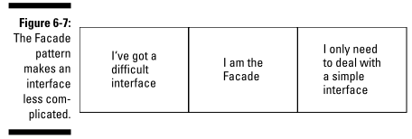

The Adapters are more about making an interface easier to work with, while Facade defines a higher-level interface that makes the subsystem easier to use

Warning: dùng Facade phải tạo thêm 1 layer, nếu các code bên dưới thay đổi, thì bạn phải update cả layer Facade

## Chapter 7: The Template Method and Builder Patterns

### 7.1. Template Method pattern

Giả sử công ty bạn muốn lập trình 1 con robot để nó có thể tự thiết kế xe hơi. Cái con robot xe hơi này có các method chính sau

```java
// Automotive: thuộc về oto
class AutomotiveRobot {
    public void start() {
        System.out.println("Starting....");
    }
    public void getParts() {
        System.out.println("Getting a carburetor...."); // Bộ chế hòa khí, 1 bộ phận của oto
    }
    public void assemble() {
        System.out.println("Installing the carburetor....");
    }
    public void test() {
        System.out.println("Revving the engine....");
    }
    public void stop() {
        System.out.println("Stopping....");
    }
    public void go() {
        start();
        getParts();
        assemble();
        test();
        stop();
    }
}
```

Con robot thiết kế xong, chạy ngon lành! Sau đó tháng sau, sếp bạn lại muốn sản xuất thêm 1 loại robot nữa để nó sản xuất bánh quy! Con robot này có các bước làm bánh quy giống với robot oto, chỉ khác ở vài step, nếu như thiết kế nó từ đầu thì duplicate code khá nhiều!

Bạn liền nghĩ đến Template method pattern!

Nó là cái quái gì? Template method xác định khung (skeleton) của một thuật toán, trì hoãn (ko implement chi tiết) một số bước đối với các lớp con. Pattern này cho phép các lớp con override lại các bước nhất định của một thuật toán mà không thay đổi cấu trúc của thuật toán

Nghĩa là: bạn dùng Template method pattern khi bạn có 1 thuật toán gồm nhiều bước, và bạn muốn customize lại 1 số bước trong đó! (bước nào dùng luôn được thì khỏi customize lại)

Note: nếu bạn phải customize toàn bộ các step, thì Template method pattern ko cần thiết!

```java
abstract class RobotTemplate {
    public void start() {
        System.out.println("Starting....");
    }
    public void getParts() {
        System.out.println("Getting parts....");
    }
    public void assemble() {
        System.out.println("Assembling....");
    }
    public void test() {
        System.out.println("Testing....");
    }
    public void stop() {
        System.out.println("Stopping....");
    }

    // thuật toán go của template gồm các step như ở dưới (theo đúng trình tự và số lượng),
    // class con có thể customize 1 vài step, và tất nhiên nó ko thê được phép
    // customize method này
    public final void go() {
        start();
        getParts();
        assemble();
        test();
        stop();
    }
}


// Robot oto cần định nghĩa lại các step: getParts, assemble, test
class AutomotiveRobot extends RobotTemplate { // Automotive: thuộc về oto
    @Override
    public void getParts() {
        System.out.println("Getting a carburetor...."); // Bộ chế hòa khí, 1 bộ phận của oto
    }
    @Override
    public void assemble() {
        System.out.println("Installing the carburetor....");
    }
    @Override
    public void test() {
        System.out.println("Revving the engine....");
    }
}

// Robot bánh quy cũng cần định nghĩa lại 3 step sau
class CookieRobot extends RobotTemplate {
    @Override
    public void getParts() {
        System.out.println("Getting flour and sugar....");
    }
    @Override
    public void assemble() {
        System.out.println("Baking a cookie....");
    }
    @Override
    public void test() {
        System.out.println("Crunching a cookie....");
    }
}
```

### 7.2. Add hook

> A hook is a method that controls some aspect of that algorithm

Giả sử bạn muốn tạo mới Robot làm bánh chưng và bạn muốn skip 1 step thì làm như nào? Có thể thêm hook như sau:

```java
abstract class RobotTemplate {
    // Mặc định thuật toán go sẽ cần step test, nếu class con nào ko cần
    // thì chỉ cần override lại method này
    public boolean isTest() {
        return true;
    }
    public final void go() {
        start();
        getParts();
        assemble();
        if (isTest()) { // make the testing part optional
            test();
        }
        stop();
    }
}

class ChungCakeRobot extends RobotTemplate {
    @Override
    public void getParts() {
        System.out.println("Chuẩn bị lá dong, nạt tre, gạo nếp, thịt ba chỉ, đậu xanh....");
    }

    @Override
    public void assemble() {
        System.out.println("Gói bánh xong ngồi đun....");
    }

    @Override
    public boolean isTest() {
        return false;
    }
}
```

> You use the Template Method design pattern when you’ve got an algorithm of several steps and you want to allow customization by subclasses

### 7.3. Building Robots with the Builder Pattern

Giả sử bây giờ bạn lại muốn thay đổi thứ tự các step trong method `go` ở trên thì làm thế nào? Rõ ràng method go của Template method pattern là final, nên ko thể override lại để thay đổi flow của thuật toán `go` được! Bạn có thể dùng builder pattern

Note: Builder pattern trong sách này khá KHÁC so với builder hay thấy trong Java (chẳng hạn trong Lombok). Các builder trong Java được dùng để khởi tạo 1 object:

- Có nhiều field
- Mỗi 1 object có thể khởi tạo các field mình muốn, ko cần khởi tạo toàn bộ field (do đó nếu dùng constructor thì sẽ phải tạo rất nhiều constructor)
- Tương lai có thể thêm các field mới

Quay lại ví dụ, ta sẽ tạo 1 builder như sau:

```java
interface RobotBuildable {
    public void go();
}
interface RobotBuilder {
    public void addStart();
    public void addGetParts();
    public void addAssemble();
    public void addTest();
    public void addStop();
    public RobotBuildable getRobot();
}

class CookieRobotBuilder implements RobotBuilder {
    private CookieRobotBuildable robot;
    private List<Integer> actions;
    public CookieRobotBuilder() {
        robot = new CookieRobotBuildable();
        actions = new LinkedList<Integer>();
    }
    @Override
    public void addStart() {
        actions.add(1);
    }
    @Override
    public void addGetParts() {
        actions.add(2);
    }
    @Override
    public void addAssemble() {
        actions.add(3);
    }
    @Override
    public void addTest() {
        actions.add(4);
    }
    @Override
    public void addStop() {
        actions.add(5);
    }
    @Override
    public RobotBuildable getRobot() {
        robot.loadActions(actions);
        return robot;
    }
}

class CookieRobotBuildable implements RobotBuildable {
    private List<Integer> actions;
    public void loadActions(List<Integer> actions) {
        this.actions = actions;
    }
    @Override
    public final void go() {
        Iterator<Integer> itr = actions.iterator();
        while (itr.hasNext()) {
            switch (itr.next()) {
                case 1:
                    start();
                    break;
                case 2:
                    getParts();
                    break;
                case 3:
                    assemble();
                    break;
                case 4:
                    test();
                    break;
                case 5:
                    stop();
                    break;
            }
        }
    }
    // các method start,getParts,...
}

public static void main(String[] args) {
    RobotBuilder builder = new CookieRobotBuilder();
    builder.addStart();
    builder.addTest();
    builder.addAssemble();
    builder.addStop();

    RobotBuildable robot = builder.getRobot();
    robot.go();
}
```

Có thể làm cách khác: [my personal way](./chapter7/builder/myway/BuilderPatternMyWay.java)

## Chapter 8: Handling Collections with the Iterator and Composite Patterns

### 8.1. Iterator pattern

Giả sử công ty bạn chia thành các Division (bộ phận), bạn cần theo dõi các phó giám đốc (VP) ở từng bộ phận (do cty bạn có quá nhiều VP :v). Class Division sẽ như sau

```java

// Mỗi bộ phận lưu danh sách các phó chủ tịch!
// Cty có quá nhiều phó chủ tịch!!!
class Division {
    private String name; // tên bộ phận
    private VP[] VPs = new VP[100];
    private int number = 0;
}
```

Bài toán đơn giản thôi, dùng iterator để duyệt cái danh sách các VP ở trên. Nhưng đầu tiên hãy nói về iterator pattern đã

> These days, you have all kinds of collections to work with — trees, binary trees, arrays, ring buffers, hashes, hash maps, array lists, and many more

Các loại CTDL (collection) trên lưu trữ data theo từng cách riêng, và nếu như muốn truy cập từng phần tử trong từng CTDL đó, bạn sẽ phải hiểu rõ cách mà chúng lưu data như nào!  
=> Đó chính là lúc nên dùng iterator pattern, nó sẽ cho phép bạn truy cập phần tử của mọi CTDL theo 1 cách tiêu chuẩn **mà ko cần biết cách tổ chức dữ liệu bên trong** (mọi CTDL có thể được duyệt theo cùng 1 cách khi dùng iterator)

> Iterator: Provides a way to access the elements of an aggregate object sequentially without exposing its underlying representation

> iterators are designed to let you handle many different kinds of collections by accessing their members in a standard, accepted way, without having to know the internal details of those collections

**Iterator pattern khá hữu dụng khi bạn tạo 1 collection là sự kết hợp của nhiề sub-collection, chẳng hạn list với hash**

> Why aren’t iterators built into the collections they work with> The design insight here is one of what’s called single responsibility: the collection maintains the collection; the iterator provides access to the elements of the collection

Trong Java, bạn chỉ cần implement interface `Iterator` là được rồi!

Quay lại ví dụ, giả sử bạn tạo 1 CTDL tên là Division để quản lý các VP, ta cần tạo 1 iterator để duyệt các VP được lưu trong mảng. (Trong ví dụ này dùng mảng cho đơn giản vì thực tế có thể bạn sẽ lưu VP bằng 1 CTDL phức tạp hơn (AVL Tree, TRIE...))

```java
// Vice President
class VP {
    private String name;    // tên của VP
    private String division;    // tên của division mà ông ta đang quản lý
    // constructor, getters, setters
}

// Mỗi bộ phận lưu danh sách các phó chủ tịch!
// Cty bạn có quá nhiều phó chủ tịch!!! Thật nực cười :v
class Division {
    private String name; // tên bộ phận
    private VP[] VPs = new VP[100];
    private int number = 0; // số lượng VP, chỉ dùng cho CTDL Division, tức là ko có getter

    public void addVP(String name) {
        VP vp = new VP(name, this.name);
        VPs[number++] = vp;
    }

    // Iterating over vice presidents:
    // iterator để duyệt các phó chủ tịch của cty
    public Iterator<VP> vpIterator() {
        return new VPIterator();
    }

    // Thường thì sẽ tạo class Iterator là inner class, để có thể access trực tiếp tới
    // biến mà CTDL dùng để lưu data (trong vd này là mảng VPs của Division)
    // (trong sách tên là DivisionIterator)
    private class VPIterator implements Iterator<VP> {
        private int location = 0;

        @Override
        public boolean hasNext() {
            return location < VPs.length && VPs[location] != null;
        }

        @Override
        public VP next() {
            return VPs[location++];
        }
    }
}
public static void main(String[] args) {
    Division division = new Division("Sales");
    division.addVP("Ted");
    division.addVP("Bob");
    division.addVP("Carol");
    division.addVP("Alice");

    Iterator<VP> iter = division.vpIterator();
    while (iter.hasNext()) {
        System.out.println(iter.next());
    }
}
```

> Java 5 makes working with iterators all the more easy by making them disappear entirely. You can do that with the for/in statement

```java
for (String vp : VPs){
    System.out.println(vp);
}
```

### 8.2. Putting Together Composites

Trong ví dụ trên, bạn đã in ra các VP của 1 Division, bài toán bây giờ mở rộng hơn, bạn phải in ra toàn bộ các VP của tất cả các Division. Chưa hết, 1 Division có thể có sub-division, và trong đó cũng có các VP, bạn phải in ra hết

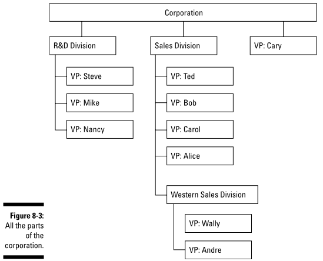

> The Composite pattern is all about creating tree-like structures where the leaves in a structure can be treated in the same way as the branches

> Compose objects into tree structures to represent part-whole hierarchies. Composite lets clients treat individual objects and compositions of objects uniformly

Hiểu đơn giản thì Composite pattern sẽ tổng hợp các object thành kiểu cấu trúc cây (tree), và các lá và các cành sẽ có cấu trúc giống nhau

> The insight behind the Composite pattern is really about treating the leaves and branches in a tree-like structure the same way, not about tree structures per se

**Để implement composite pattern, bạn cần 1 abstract class cho cả lá và cành (leaves and branches)**

```java
// Abstract class dùng cho cả Division và VP
abstract class Corporate {
    // bắt buộc các class con đều phải định nghĩa các print
    public abstract void print();
    public abstract String getName();
    public abstract Iterator<? extends Corporate> iterator();
    // mặc định ko có method add (chẳng hạn VP ko cần add gì)
    public void add(Corporate c) {}
}

class Division extends Corporate {
    // Do bên trong 1 Division có cả Division khác và Vice President,
    // mà 2 object đó đều là con của Corporate, do đó có thể lưu cả 2
    // trong 1 array kiểu Corporate
    private Corporate[] corporate = new Corporate[100];
    private int number = 0;
    private String name;
    @Override
    public String getName() {
        return name;
    }
    // Tên là add chứ ko phải là addVP như trước, vì giờ có thể
    // phải add cả 1 object kiểu Division
    @Override
    public void add(Corporate c) {
        corporate[number++] = c;
    }
    @Override
    public Iterator<Corporate> iterator() {
        return new DivisionIterator();
    }
    @Override
    public void print() {
        System.out.println("Division: " + name);
        Iterator<Corporate> iterator = iterator();
        while (iterator.hasNext()) {
            Corporate c = iterator.next();
            c.print();
        }
    }
    private class DivisionIterator implements Iterator<Corporate> {
        private int location = 0;
        @Override
        public boolean hasNext() {
            return location < corporate.length && corporate[location] != null;
        }
        @Override
        public Corporate next() {
            return corporate[location++];
        }
    }
}

class VP extends Corporate {
    private String name;
    private String division;
    // Do VP ko lưu collection nào nên ko cần Iterator
    @Override
    public Iterator<VP> iterator() {
        return new VPIterator();
    }
    private class VPIterator implements Iterator<VP> {
        @Override
        public boolean hasNext() {
            return false;
        }
        @Override
        public VP next() {
            return null;
        }
    }
    @Override
    public void print() {
        System.out.println("[VP] Name: " + name + ", Division:" + division);
    }
}

public static void main(String[] args) {
    Division corporation = new Division("Công ty cổ phần Tuzaku");

    Division rnd = new Division("R&D");
    rnd.add(new VP("Steve", "R&D"));
    rnd.add(new VP("Mike", "R&D"));
    rnd.add(new VP("Nancy", "R&D"));

    Division sales = new Division("Sales");
    sales.add(new VP("Ted", "Sales"));
    sales.add(new VP("Bob", "Sales"));
    sales.add(new VP("Carol", "Sales"));
    sales.add(new VP("Alice", "Sales"));

    Division western = new Division("Western Sales");
    western.add(new VP("Wally", "Western Sales"));
    western.add(new VP("Andre", "Western Sales"));
    sales.add(western);

    VP vp = new VP("Cary", "Division root");

    corporation.add(rnd); // add sub-division
    corporation.add(sales); // add sub-division
    corporation.add(vp); // add VP

    corporation.print();
}
```

Code thực tế có thêm level để dễ quản lý, [xem thêm tại đây](./chapter8/composite/myway_no_need_corporation/CompositePattern.java)

## Chapter 9: Getting Control of Your Objects with the State and Proxy Patterns

### 9.1. Finite-state machine

Cty bạn cần thiết kế 1 hệ thống thuê nhà tự động (rental automat, gọi tắt là automat):

- Hệ thống sẽ chấp nhận các đơn xin thuê (application) và phân phát chìa khóa (dispense keya)
- Người thuê mới có thể gửi đơn đăng ký thuê của họ đến automat
- Khi người thuê nhà gửi đơn đăng ký, automat sẽ kiểm tra nó. Nếu đơn đăng ký được chấp thuận, automat sẽ phân phát chìa khóa cho người thuê; nếu không, automat sẽ thông báo cho người thuê rằng anh ta đã bị từ chối và quay lại đợi
- Nếu automat cho họ thuê, sau đó automat cần kiểm tra xem còn căn hộ cho thuê nữa ko

Từ trên có thể thấy hệ thống gồm 4 state sau:

- Đợi người thuê nhà mới
- Nhận đơn
- Cho thuê căn hộ
- Toàn bộ căn hộ đã được thuê

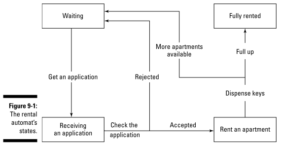

> When you face a large-scale application and the coding gets out of hand, it often helps to start thinking in terms of **various states**. This device helps you segment your code into independent units (states) — ideally, each state should be logically independent of the others, so **thinking in terms of states can automatically divide your code into discrete sections**

State pattern: **Allow an object to alter its behavior when its internal state changes. The object will appear to change its class**

Cho phép object thay đổi state (trạng thái) bên trong nó, các object khác có thể check trạng thái hiện tại của nó. State pattern hữu dụng khi hệ thống của bạn lớn và phức tạp

```java
class RentalAutomat {
    private final static int WAITING = 0;
    private final static int GOT_APPLICATION = 1;
    private final static int APARTMENT_RENTED = 2;
    private final static int FULLY_RENTED = 3;
    private Random random;
    private int numberApartments;
    private int state;

    public RentalAutomat(int n) {
        numberApartments = n;
        random = new Random(System.currentTimeMillis());
        state = WAITING;
    }

    // Hệ thống nhận đơn xin thuê nhà
    public void receiveApplication() {
        switch (state) {
            case FULLY_RENTED:
                System.out.println("Sorry, we’re fully rented.");
                break;
            case WAITING:
                state = GOT_APPLICATION;
                System.out.println("Thanks for the application.");
                break;
            case GOT_APPLICATION:
                System.out.println("We already got your application.");
                break;
            case APARTMENT_RENTED:
                System.out.println("Hang on, we’re renting you an apartment.");
                break;
        }
    }

    // Hệ thống xử lý đơn xin thuê nhà
    public void processApplication() {
        int yesno = random.nextInt() % 10;
        switch (state) {
            case FULLY_RENTED:
                System.out.println("Sorry, we’re fully rented.");
                break;
            case WAITING:
                System.out.println("You have to submit an application.");
                break;
            case GOT_APPLICATION:
                if (yesno > 4 && numberApartments > 0) {
                    System.out.println("Congratulations, you were approved.");
                    state = APARTMENT_RENTED;
                    rentApartment();
                } else {
                    System.out.println("Sorry, you were not approved.");
                    state = WAITING;
                }
                break;
            case APARTMENT_RENTED:
                System.out.println("Hang on, we’re renting you an apartment.");
                break;
        }
    }

    // Hệ thống thực hiện việc cho thuê nhà
    private void rentApartment() {
        switch (state) {
            case FULLY_RENTED:
                System.out.println("Sorry, we’re fully rented.");
                break;
            case WAITING:
                System.out.println("You have to submit an application.");
                break;
            case GOT_APPLICATION:
                System.out.println("You must have your application checked.");
                break;
            case APARTMENT_RENTED:
                System.out.println("Renting you an apartment....");
                numberApartments--;
                dispenseKeys();
                break;
        }
    }

    // Giao chìa khóa cho người thuê
    private void dispenseKeys() {
        switch (state) {
            case FULLY_RENTED:
                System.out.println("Sorry, we’re fully rented.");
                break;
            case WAITING:
                System.out.println("You have to submit an application.");
                break;
            case GOT_APPLICATION:
                System.out.println("You must have your application checked.");
                break;
            case APARTMENT_RENTED:
                System.out.println("Here are your keys!");
                state = WAITING;
                break;
        }
    }
}

public static void main(String[] args) {
    RentalAutomat rentalAutomat = new RentalAutomat(9);
    rentalAutomat.receiveApplication();
    rentalAutomat.processApplication();
}
```

Hệ thống trên lưu mỗi state dưới 1 biến constant, có điều nếu sau này cần thêm mới state thì lại phải sửa TOÀN BỘ code cũ (cả 4 method ở trên) => vi phạm nguyên lý **Open–closed principle**

### 9.2. Using objects to encapsulate state

Giả sử hệ thống của bạn, tương lai nếu thêm state, thì chỉ phải sửa toàn bộ code bên trong 4 method trên thôi, chứ ko cần thêm mới các method khác (ko cần thêm mới bước nào nữa trong quá trình cho thuê nhà). Như đã nói ở trước, volatile code cần phải tách riêng!

> It’s a better idea to give each state its own class.

=> Sau này nếu hệ thống cần thêm mới state, chỉ cần tạo mới class chứ ko cần sửa code cũ. Đầu tiên tạo interface State và Automat

```java
// Sau này nếu hệ thống cần thêm mới state, chỉ cần tạo class mới implement interface này
public interface State {
    public String gotApplication();
    public String checkApplication();
    public String rentApartment();
    public String dispenseKeys();
}
interface AutomatInterface {
    public void gotApplication();
    public void checkApplication();
    public void rentApartment();
    public void setState(State state);
    public State getWaitingState();
    public State getGotApplicationState();
    public State getApartmentRentedState();
    public State getFullyRentedState();
    // gets the current number of apartments for rent
    public int getCount();
    // sets the current number of apartments for rent
    public void setCount(int count);
}
```

[Full code](./chapter9/state/encapsulate_state/RentalAutomatSystem.java)

### 9.3. Standing In for Other Objects with Proxies

Updating...

## Chapter 10: Coordinating Your Objects with the Command and Mediator Patterns

### 10.1. Command pattern

Giả sử cty bạn có 1 hệ thống tên là Crisis Center, được đặt ở 3 server như dưới. Mỗi lần có lỗi xảy ra, bạn phải gọi các method như dưới để fix

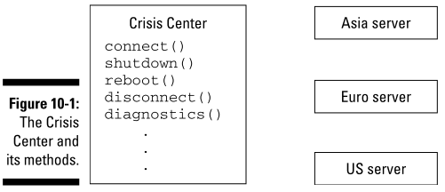

Vấn đề là đôi khi sometimes commands are sent to the wrong server, or programmers forget to connect to a server before issuing commands to it

Command design pattern: bạn nên đóng gói (encapsulate) các action riêng rẽ thành 1 object cho từng mục tiêu cụ thể, chẳng hạn:

```java
public class ShutDownCommand {
    public void execute() {
        anInterface.connect();
        anInterface.shutdown();
        anInterface.disconnect();
        System.out.println();
    }
}
```

Như vậy, user sẽ ko bị quên các step của từng action, hay gọi nhầm action nữa

> Encapsulate a request as an object, thereby letting you parameterize clients with different requests, queue or log requests, and support undoable operations

```java
// Interface bao gồm toàn bộ các action riêng rẽ
public interface Receiver {
    public void connect();
    public void diagnostics();
    public void reboot();
    public void shutdown();
    public void disconnect();
}
class AsiaServer implements Receiver {
    @Override
    public void connect() {
        System.out.println("You’re connected to the Asia server.");
    }
    @Override
    public void diagnostics() {
        System.out.println("The Asia server diagnostics check out OK.");
    }
    @Override
    public void shutdown() {
        System.out.println("Shutting down the Asia server.");
    }
    @Override
    public void reboot() {
        System.out.println("Rebooting the Asia server.");
    }
    @Override
    public void disconnect() {
        System.out.println("You’re disconnected from the Asia server.");
    }
}
class EuroServer implements Receiver {} // tương tự AsiaServer
class USServer implements Receiver {} // tương tự AsiaServer

// Interface dùng để thực thi 1 tập các action
public interface Command {
    // Command execute: dùng để thực thi 1 tập các action theo 1 trình tự nhất định
    // (class con sẽ tự implement tùy ý), user ko cần phải call manually
    // từng action một nữa, như vậy có thể tránh được call nhầm hoặc call ko đúng trình tự
    public void execute();

    // Command undo: undo các action vừa thực thi ở command execute
    public void undo();
}
class ShutDownCommand implements Command {
    Receiver receiver;
    @Override
    public void execute() {
        receiver.connect();
        receiver.shutdown();
        receiver.disconnect();
        System.out.println();
    }
    @Override
    public void undo() {
        System.out.println("Undoing shutdown command...");
        receiver.connect();
        receiver.reboot();
        receiver.disconnect();
        System.out.println("Undoing successfully!\n");
    }
}
class RunDiagnosticsCommand implements Command {
    Receiver receiver;
    @Override
    public void execute() {
        receiver.connect();
        receiver.diagnostics();
        receiver.disconnect();
        System.out.println();
    }
    @Override
    public void undo() {
        System.out.println("Cannot undo diagnostic command!!!\n");
    }
}
class RebootCommand implements Command {
    Receiver receiver;
    @Override
    public void execute() {
        receiver.connect();
        receiver.reboot();
        receiver.disconnect();
        System.out.println();
    }
    @Override
    public void undo() {
        System.out.println("Undoing reboot command...");
        receiver.connect();
        receiver.shutdown();
        receiver.disconnect();
        System.out.println("Undoing successfully!\n");
    }
}

/**
 * The invoker là class thực thi command, bạn cần phải load command
 * cần thực thi vào và bắt nó run command đó. Giả sử rằng việc
 * undo command giống như stack, tức là bạn phải undo command gần nhất
 * được thực thi xong mới được phép undo command được thực thi trước đó.
 * Như vậy có thể dùng Stack để lưu các command
 */
public class Invoker {
    private Stack<Command> stackCommands;

    public Invoker() {
        stackCommands = new Stack<>();
    }

    public void setCommand(Command command) {
        stackCommands.add(command);
    }

    // Đổi tên thành execute cho trùng với tên method của Command
    public void execute() {
        stackCommands.peek().execute();
    }

    public void undo() {
        stackCommands.pop().undo();
    }
}

public static void main(String[] args) {
    // Invoker là class đảm nhiệm việc run command nào đó,
    // muốn đổi command khác bạn phải load command cần đổi (dùng method setCommand)
    Invoker invoker = new Invoker();

    // Các receiver cho từng server (là các class bao gồm các action riêng rẽ)
    Receiver asiaServer = new AsiaServer();
    Receiver euroServer = new EuroServer();
    Receiver usServer = new USServer();

    // Tạo các command (gồm tập các action)
    Command shutDownAsia = new ShutDownCommand(asiaServer);
    Command runDiagnosticsAsia = new RunDiagnosticsCommand(asiaServer);
    Command shutDownEuro = new ShutDownCommand(euroServer);
    Command runDiagnosticsEuro = new RunDiagnosticsCommand(euroServer);
    Command rebootEuro = new RebootCommand(euroServer);
    Command rebootUS = new RebootCommand(usServer);

    invoker.setCommand(shutDownAsia);
    invoker.execute();

    invoker.setCommand(runDiagnosticsEuro);
    invoker.execute();

    invoker.setCommand(rebootEuro);
    invoker.execute();

    invoker.setCommand(shutDownEuro);
    invoker.execute();

    invoker.setCommand(runDiagnosticsAsia);
    invoker.execute();

    invoker.setCommand(rebootUS);
    invoker.execute();

    invoker.undo();
    invoker.undo();
    invoker.undo();
}
```

### 10.2. Mediator Pattern

> Define an object that encapsulates how a set of objects interact. Mediator promotes loose coupling by keeping objects from referring to each other explicitly, and it lets you vary their interaction independently
